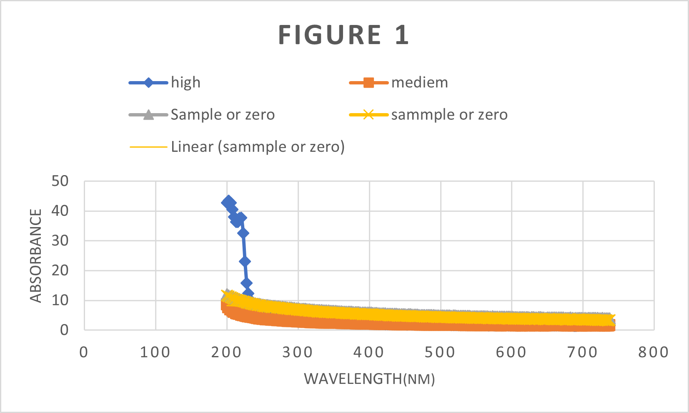
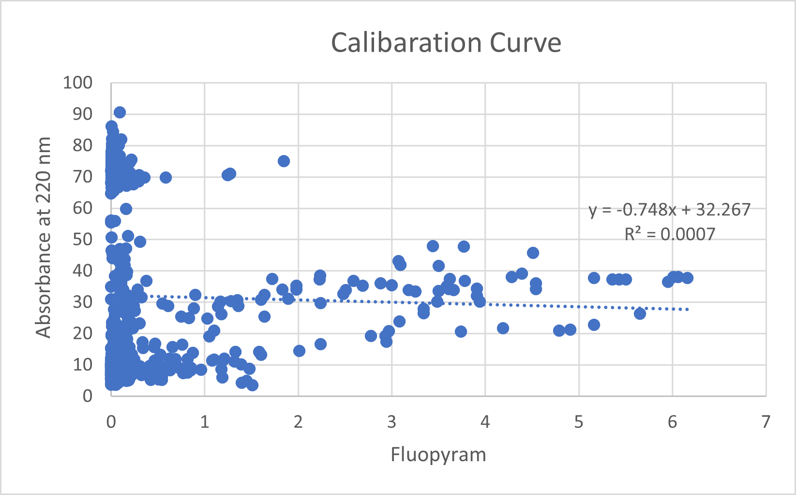

<div align="center">
  <h1>🧪 UV-Vis Chemometrics for Pesticide Monitoring</h1>
  <p><b>A computational study on the limitations of direct spectrophotometry in complex environmental matrices.</b></p>

  
  
  
  
  
</div>

---

## 📑 Table of Contents
1. [Project Motivation](#-project-motivation)
2. [The Problem](#-the-problem)
3. [Methodology](#-methodology)
4. [Key Findings & Results](#-key-findings--results)
5. [How to Reproduce](#-how-to-reproduce)
6. [Repository Structure](#-repository-structure)
7. [Citation](#-citation)

---

## 🎯 Project Motivation
Monitoring pesticide residues (fluopyram, diflufenican, mesosulfuron) in agricultural runoff is critical for environmental safety. While UV-Vis spectrophotometry is a cheap and fast analytical tool, this project investigates whether it can reliably quantify these pesticides in real-world, complex water matrices using chemometrics.

## ⚠️ The Problem: Why did the models fail?
This is an **open-science negative-result study**. Both univariate (Beer-Lambert) and multivariate (PLS) models failed to accurately predict pesticide concentrations. The data proved that:
1. **Trace Concentrations:** The mean concentration (0.39) falls below the practical Limit of Detection (LOD) for standard UV-Vis.
2. **Matrix Interference:** Background dissolved organic matter (DOM) absorbs massively in the deep-UV region (200–250 nm), masking the target analytes.
3. **Spectral Overlap:** The three pesticides share similar aromatic chromophores, leading to severe multicollinearity that standard PLS could not resolve.

## 🔬 Methodology
- **Dataset:** 2026 Zenodo open-source spectral dataset (845 samples, 200–750 nm).
- **Univariate Analysis:** Identified $\lambda_{max}$ at 202.5 nm ($\pi \rightarrow \pi^*$ transitions).
- **Multivariate Analysis:** Built a Partial Least Squares (PLS) regression model in Python using the full spectrum.

## 📊 Key Findings & Results

| Metric | Univariate (Beer-Lambert) | Multivariate (PLS Regression) |
| :--- | :--- | :--- |
| **Wavelength Used** | 202.5 nm ($\lambda_{max}$) | Full Spectrum (200–750 nm) |
| **R² Score** | 0.0007 | 0.055 |
| **Mean Recovery** | N/A | 145.1% |
| **Target Avg. Conc.** | 0.39 | 0.39 |

*Conclusion: Direct UV-Vis analysis is unviable for these trace analytes without prior Solid-Phase Extraction (SPE) or the use of LC-MS/MS.*
---


## 🚀 How to Reproduce
To run this analysis locally, ensure you have Python 3.9+ installed.

```bash
# 1. Install dependencies
pip install -r requirements.txt

# 2. Download the data from Zenodo and place it in the /data folder

# 3. Run the script
python scripts/pls_analysis.py
